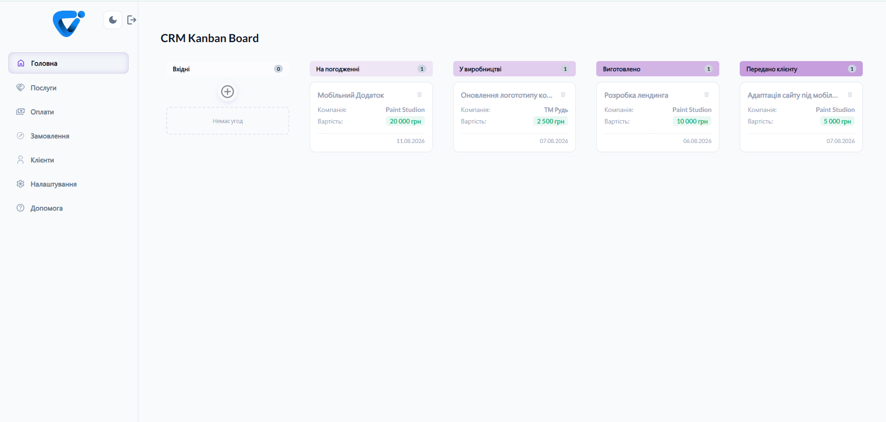
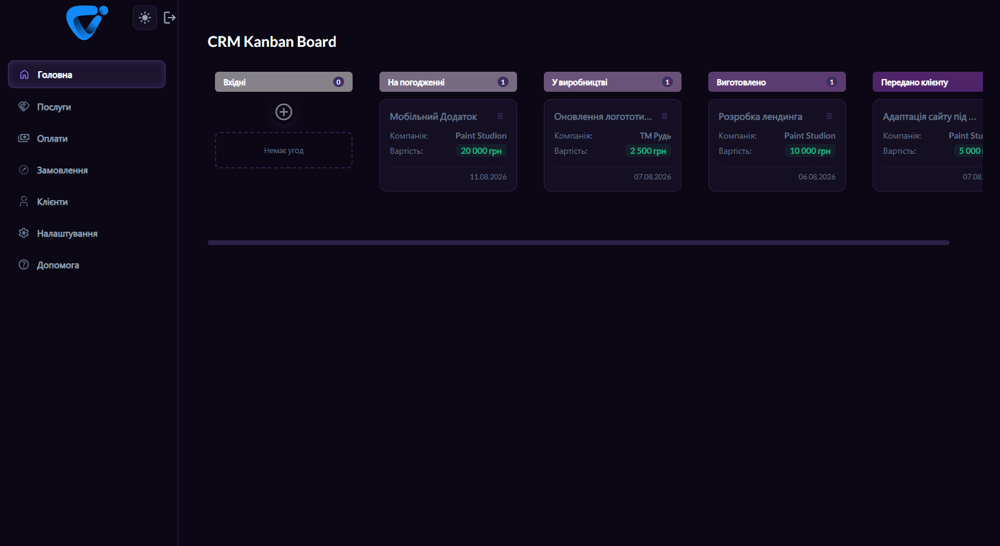
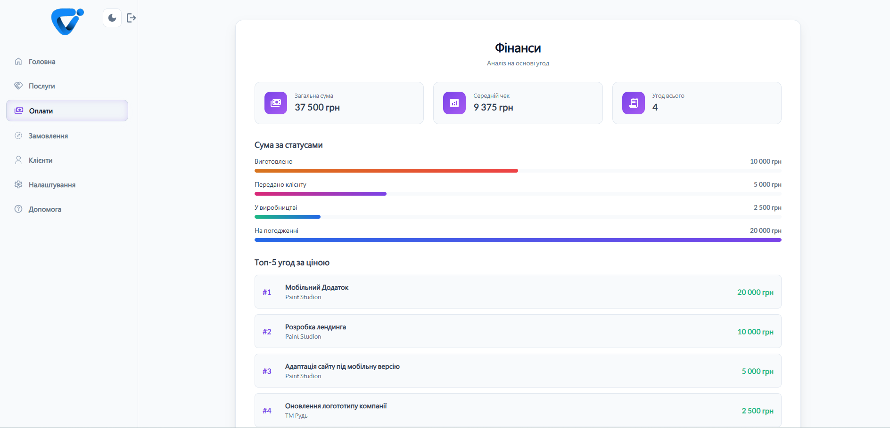
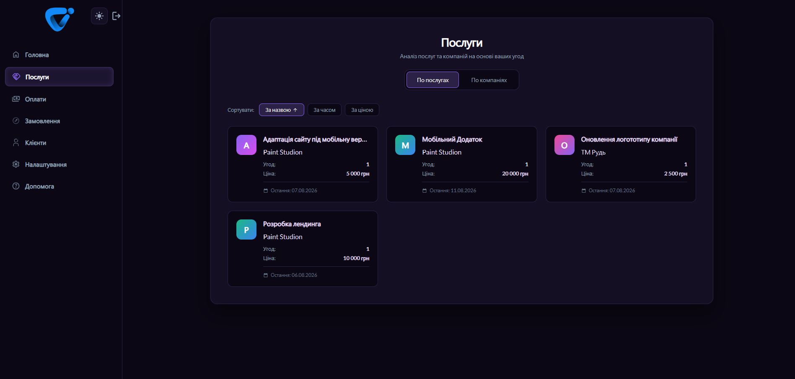
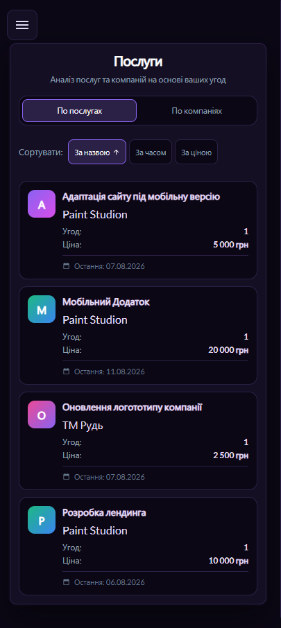
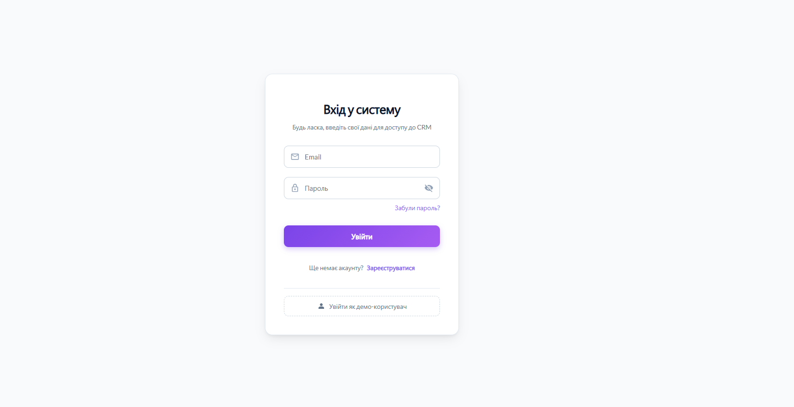
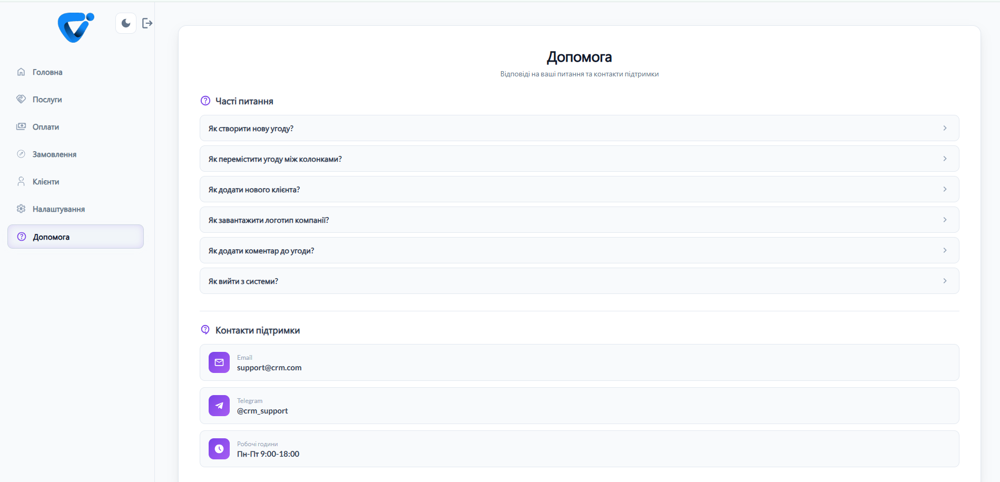

# 🎯 CRM System

> Full-stack CRM system for deal management with Kanban board

[](https://crm-system-fawn-sigma.vercel.app)
[](https://nuxt.com/)
[](https://vuejs.org/)
[](https://www.typescriptlang.org/)

---

## 🚀 Live Demo

🔗 **[https://crm-system-fawn-sigma.vercel.app](https://crm-system-fawn-sigma.vercel.app)**

---

## 📋 Overview

A modern, full-featured CRM system built with **Nuxt 4** and **Vue 3** for managing business deals through an intuitive Kanban board. The application provides comprehensive tools for tracking customers, analyzing finances, and managing orders with a beautiful dark/light theme system.

**Key highlights:**
- 🎨 Beautiful UI with dark/light theme support
- 📱 Fully responsive design (mobile-first approach)
- 🔄 Real-time drag-and-drop for deal management
- 📊 Built-in analytics and financial reporting
- 🔐 Secure authentication via Appwrite

---

## 📸 Screenshots

### 🎯 Kanban Board

#### Light Theme (Desktop)


#### Dark Theme (Desktop)


---

### 📊 Finance Dashboard



---

### 🎨 Services Analytics

#### Dark Theme (Desktop)


#### Dark Theme (Mobile)


---

### 🔐 Authentication



---

### ❓ Help & Support



---

## 🛠 Tech Stack

### Frontend
- **[Nuxt 4](https://nuxt.com/)** - The Intuitive Vue Framework
- **[Vue 3](https://vuejs.org/)** - Progressive JavaScript Framework
- **[TypeScript](https://www.typescriptlang.org/)** - Type Safety

### State Management
- **[Pinia](https://pinia.vuejs.org/)** - Intuitive Store Management

### Data Fetching
- **[TanStack Query](https://tanstack.com/query/latest)** - Server State Management

### UI & Styling
- **[Nuxt UI v4](https://ui.nuxt.com/)** - UI Components
- **[Custom CSS Variables](https://developer.mozilla.org/en-US/docs/Web/CSS/--*)** - Theme System
- **[Google Fonts](https://fonts.google.com/)** - Lato Font Family

### Forms & Validation
- **[VeeValidate](https://vee-validate.logaretm.com/)** - Form Validation

### Backend & Database
- **[Appwrite](https://appwrite.io/)** - Backend-as-a-Service (BaaS)

### Deployment
- **[Vercel](https://vercel.com/)** - Cloud Platform

---

## ✨ Features

###  Kanban Board
- **5-stage pipeline**: Incoming → Under Approval → In Production → Produced → Delivered
- **Drag-and-drop**: Move deals between columns to update status
- **Deal cards**: Show customer, price, and creation date
- **Quick actions**: Create, edit, and delete deals

###  Customer Management
- **Customer list**: View all customers with avatars and contact info
- **Search & filter**: Find customers by name or email
- **Customer profiles**: Edit customer details and view deal history

### 💰 Financial Analytics
- **Dashboard metrics**: Total sum, average check, deal count
- **Status breakdown**: Visual progress bars for each stage
- **Top deals**: Ranked list of highest-value deals

### 📦 Services & Companies
- **Service view**: Aggregated data by service type
- **Company view**: Deal statistics per customer
- **Sorting**: By name, date, or price
- **Drill-down**: Click to view company details

### 📋 Orders Timeline
- **Chronological view**: All deals grouped by date
- **Status filtering**: Filter by deal stage
- **Deal details**: Price, customer, and status badges

###  Authentication
- **Email/password login**: Secure authentication via Appwrite
- **Registration**: Create new accounts
- **Password recovery**: Forgot password flow
- **Demo mode**: Try the app without registration

### 🎨 Theme System
- **Dark/Light themes**: Toggle between themes
- **System preference**: Auto-detect OS theme
- **Persistence**: Save theme choice in localStorage
- **Smooth transitions**: Animated theme switching

### 📱 Responsive Design
- **Mobile-first**: Optimized for all screen sizes
- **Collapsible sidebar**: Hamburger menu on mobile
- **Touch-friendly**: Optimized for touch interactions

### ❓ Help & Support
- **FAQ section**: Expandable accordion with common questions
- **Support contacts**: Email, Telegram, working hours

### 🛡️ Code Quality
- **ESLint**: Code linting with Nuxt-specific rules
- **Prettier**: Automatic code formatting
- **Husky**: Git hooks for pre-commit checks
- **lint-staged**: Run linters on staged files only

---

## 🔧 Technical Highlights

### Modern Vue 3 Architecture
- **Composition API**: Clean, reusable component logic
- **TypeScript**: Full type safety across the application
- **Nuxt 4**: SSR/SSG support with file-based routing

### State Management
- **Pinia stores**: Modular state management
  - `auth.store.ts` - User authentication state
  - `theme.store.ts` - Theme preferences
  - `deal-slide.store.ts` - Deal detail panel state
  - `isLoading.store.ts` - Global loading state

### Data Fetching & Caching
- **TanStack Query**: Server state management
  - Automatic caching and refetching
  - Optimistic updates for better UX
  - Loading and error states handling
  - Mutation support for create/update/delete

### Real-time Interactions
- **Drag-and-drop**: Native HTML5 drag-and-drop API
- **Status updates**: Instant UI updates on deal movement
- **Form validation**: Real-time validation with VeeValidate

### Theme System Implementation
- **CSS Variables**: Dynamic theming without CSS-in-JS
- **System detection**: `prefers-color-scheme` media query
- **localStorage persistence**: User preference saved
- **Smooth transitions**: CSS transitions for theme changes

### Responsive Design
- **Mobile-first CSS**: Base styles for mobile, enhanced for desktop
- **Flexbox & Grid**: Modern layout techniques
- **Media queries**: Breakpoints for different screen sizes
- **Touch optimization**: Larger tap targets on mobile

### Backend-as-a-Service
- **Appwrite**: Self-hosted Firebase alternative
  - Authentication (email/password)
  - Database (collections for deals, customers, comments)
  - Storage (file uploads)
  - Real-time subscriptions (future enhancement)

---

## 🏗 Project Structure

```
crm-system/
├── app/
│   ├── app.vue                    # Root component
│   ├── assets/
│   │   ── css/
│   │       └── main.css           # Global styles & CSS variables
│   ├── components/
│   │   ├── card/
│   │   │   └── Card.vue           # Deal card component
│   │   ├── kanban/
│   │   │   ├── CreateDeal.vue     # Deal creation form
│   │   │   ├── kanban.data.ts     # Column definitions
│   │   │   ├── kanban.types.ts    # TypeScript interfaces
│   │   │   ├── useKanbanQuery.ts  # TanStack Query hooks
│   │   │   ├── useDeleteDeal.ts   # Delete mutation
│   │   │   ── slideover/         # Deal detail panel
│   │   │       ├── Slideover.vue
│   │   │       ├── Top.vue
│   │   │       ├── Comments.vue
│   │   │       └── useComments.ts
│   │   └── layout/
│   │       ├── Sidebar.vue        # App sidebar
│   │       ├── Menu.vue           # Navigation menu
│   │       ├── menu.data.ts       # Menu items config
│   │       ├── ThemeToggle.vue    # Theme switcher
│   │       └── Loader.vue         # Loading spinner
│   ├── data/
│   │   ├── help-faq.data.ts       # FAQ content
│   │   └── settings-stats.data.ts # Stats configuration
│   ├── layouts/
│   │   ├── default.vue            # Main layout (auth guard)
│   │   └── auth.vue               # Auth pages layout
│   ├── pages/
│   │   ├── index.vue              # Kanban board (home)
│   │   ├── Login.vue              # Login/Registration
│   │   ├── forgot-password.vue    # Password recovery
│   │   ├── customer/              # Customers module
│   │   ├── orders/                # Orders timeline
│   │   ├── payments/              # Finance analytics
│   │   ├── services/              # Services analytics
│   │   ├── settings/              # User settings
│   │   ── help/                  # Help & FAQ
│   ├── plugins/
│   │   ├── appwrite.client.ts     # Appwrite SDK init
│   │   ├── dayjs.client.ts        # Day.js date library
│   │   └── vue-query.ts           # TanStack Query setup
│   ├── store/
│   │   ├── auth.store.ts          # Auth state
│   │   ├── deal-slide.store.ts    # Slideover state
│   │   ├── theme.store.ts         # Theme state
│   │   └── isLoading.store.ts     # Loading state
│   ├── types/
│   │   └── deals.types.ts         # TypeScript interfaces
│   └── utils/
│       └── get-company-name.ts    # Helper functions
├── public/
│   ── screenshots/               # README screenshots
── .env.example                   # Environment variables template
├── nuxt.config.ts                 # Nuxt configuration
├── package.json                   # Dependencies
└── tsconfig.json                  # TypeScript config
```

---

## 🚀 Getting Started

### Prerequisites
- Node.js 18+ 
- npm or pnpm or yarn

### Installation

```bash
# Clone the repository
git clone https://github.com/Artem-Parashchuk/crm-system.git

# Navigate to project directory
cd crm-system

# Install dependencies
npm install

# Copy environment variables template
cp .env.example .env.local
```

### Environment Variables

Create `.env.local` file with the following variables:

```env
# Appwrite Configuration
NUXT_PUBLIC_APPWRITE_ENDPOINT=
NUXT_PUBLIC_APPWRITE_PROJECT_ID=

# Database IDs
NUXT_PUBLIC_DB_ID=
NUXT_PUBLIC_COLLECTION_DEALS=
NUXT_PUBLIC_COLLECTION_CUSTOMERS=
NUXT_PUBLIC_COLLECTION_COMMENTS=
NUXT_PUBLIC_COLLECTION_ORDERS=
NUXT_PUBLIC_COLLECTION_PAYMENTS=
NUXT_PUBLIC_COLLECTION_FEEDBACK=

# Storage
NUXT_PUBLIC_STORAGE_ID=

# Password Reset
NUXT_PUBLIC_RESET_PASSWORD_URL=
```

### Development

```bash
# Start development server
npm run dev

# Open http://localhost:3000
```

### Code Quality

```bash
# Run ESLint
npm run lint

# Fix ESLint errors automatically
npm run lint:fix

# Format code with Prettier
npm run format
```

>  **Note**: Husky automatically runs lint-staged on pre-commit hook, ensuring code quality before each commit.

### Production

```bash
# Build for production
npm run build

# Preview production build
npm run preview
```

---

##  Demo Account

Try the application without registration:

```
Email: test@gmail.com
Password: 12345678
```

> ️ **Note**: Demo account has limited permissions. Some features (profile editing, password change) are disabled.

---

## 👨‍💻 Author

**Artem Parashchuk**

Frontend Developer passionate about building modern web applications with Vue.js and Nuxt.

- 🐙 **GitHub**: [Artem-Parashchuk](https://github.com/Artem-Parashchuk)
- 💼 **LinkedIn**: [Artem Parashchuk](https://www.linkedin.com/in/artem-parashchuk-023998220)
- 🌐 **Live Demo**: [CRM System](https://crm-system-fawn-sigma.vercel.app)

---

<div align="center">

**Made with ❤️ using Nuxt 4 & Vue 3**

</div>
